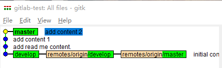

## git常用命令
@(git)[command]

-----
[TOC]
>[git中文指南](https://git-scm.com/book/zh/v2)
### 初次配置
一般在新的系统上，我们都需要先配置下自己的 Git 工作环境。配置工作只需一次，以后升级时还会沿用现在的配置。当然，如果需要，你随时可以用相同的命令修改已有的配置。
在 Windows 系统上，Git 会找寻用户主目录下的`.gitconfig` 文件。主目录即`$HOME` 变量指定的目录，一般都是 `C:\Documents and Settings\$USER`。
- 用户信息：
第一个要配置的是你个人的用户名称和电子邮件地址。这两条配置很重要，每次 Git 提交时都会引用这两条信息，说明是谁提交了更新，所以会随更新内容一起被永久纳入历史记录：
```
$ git config --global user.name "yourname"
$ git config --global user.email "email@example.com"
```
如果用了`--global`选项，那么更改的配置文件就是位于你用户主目录下的那个，以后你所有的项目都会默认使用这里配置的用户信息。如果要在某个特定的项目中使用其他名字或者电邮，只要去掉`--global`选项重新配置即可，新的设定保存在当前项目的`.git/config`文件里
```
$ cd gitlab-test/
$ cat .git/config
[core]
        repositoryformatversion = 0
        filemode = false
        bare = false
        logallrefupdates = true
        symlinks = false
        ignorecase = true
[remote "origin"]
        url = git@192.168.39.102:developers/gitlab-test.git
        fetch = +refs/heads/*:refs/remotes/origin/*
[branch "master"]
        remote = origin
        merge = refs/heads/master
[branch "develop"]
        remote = origin
        merge = refs/heads/develop
$ git config user.name "test"
$ git config user.email "test@test.com"
...
[user]
        name = test
        email = test@test.com
```
- 文本编辑器
Git 需要你输入一些额外消息的时候，会自动调用一个外部文本编辑器给你用。默认会使用操作系统指定的默认编辑器，一般可能会是`Vi`或者`Vim`。如果你有其他偏好，比如`Notepad`的话，可以重新设置：
`$ git config --global core.editor  "D:/'Program Files'/Notepad++/notepad++.exe"`
**注意**：`'Program Files'`因为中间有空格，所以必须使用单引号括起来。
- 删除配置
`$ git config --unset user.name`
- 查看配置
`$ git config <--global> --list`
### 获取帮助
想了解 Git 的各式工具该怎么用，可以阅读它们的使用帮助，方法有三：
```
$ git help <verb>
$ git <verb> --help
$ man git-<verb>
```
比如，要学习 config 命令可以怎么用，运行：
`$ git help config`
### 生成 SSH 公钥
大多数 Git 服务器都会选择使用 SSH 公钥来进行授权。系统中的每个用户都必须提供一个公钥用于授权，没有的话就要生成一个。生成公钥的过程在所有操作系统上都差不多。 首先先确认一下是否已经有一个公钥了。SSH 公钥默认储存在账户的主目录下的 ~/.ssh 目录。进去看看：
```
$ cd ~/.ssh/
$ ls
id_rsa  id_rsa.pub  known_hosts
```
`id_rsa.pub`文件是公钥，`id_rsa`文件是密钥。没有这些文件或者没有`.ssh`目录，可以用`ssh-keygen`来创建：
```
$ ssh-keygen -t rsa -C "your.email@example.com" <-b 4096>
Generating public/private rsa key pair.
Enter file in which to save the key (/Users/schacon/.ssh/id_rsa):
Enter passphrase (empty for no passphrase):
Enter same passphrase again:
Your identification has been saved in /Users/schacon/.ssh/id_rsa.
Your public key has been saved in /Users/schacon/.ssh/id_rsa.pub.
The key fingerprint is:
43:c5:5b:5f:b1:f1:50:43:ad:20:a6:92:6a:1f:9a:3a schacon@agadorlaptop.local
```
建议一直默认回车，不作信息更改。
### 获取仓库
有两种取得 Git 项目仓库的方法。 第一种是在现有项目或目录下导入所有文件到 Git 中； 第二种是从一个服务器克隆一个现有的 Git 仓库。
1. 在现有目录中初始化仓库
如果你打算使用 Git 来对现有的项目进行管理，你只需要进入该项目目录并输入：
`$ git init`
该命令将创建一个名为`.git`的子目录，这个子目录含有你初始化的 Git 仓库中所有的必须文件，这些文件是 Git 仓库的骨干。
如果你是在一个已经存在文件的文件夹（而不是空文件夹）中初始化 Git 仓库来进行版本控制的话，你应该开始跟踪这些文件并提交。 你可通过`git add`命令来实现对指定文件的跟踪，然后执行`git commit`提交。
```
$ git add .
$ git add LICENSE
$ git commit -m 'initial project version'
# 现在，你已经得到了一个实际维护（或者说是跟踪）着若干个文件的 Git 仓库。
```
2. 克隆现有的仓库
执行`git clone xxx`可以从Git服务器克隆仓库到本地：
`$ git clone git@192.168.39.102:developers/gitlab-test.git`
### git常用命令解读
#### 添加文件到版本库
现在添加一个`README.md`到版本库中。
```
$ echo "# gitlab-test" >> README.md
$ git add README.md
```
命令`git add <filename>`或`git add .`将改动添加到暂存区，后者将所有改动添加到暂存区。现在可以通过命令查看是否还有其他改动文件未提交：
```
$ git status
On branch master
Your branch is up to date with 'origin/master'.

Changes to be committed:
  (use "git reset HEAD <file>..." to unstage)

        modified:   README.md
```
查看哪些文件处于什么状态，可以用 `git status <-s|--short>` 命令。
接下来可以将改动提交到版本仓库，可以用`git commit`命令。
```
$ git commit -m "add read me content."
[master eb7738b] add read me content.
 1 file changed, 1 insertion(+)
```
继续修改`README.txt`，增加一行内容，然后通过`git status`查看文件状态。
```
$ echo "1111111111" >> README.md
$ git status
On branch master
Your branch is ahead of 'origin/master' by 1 commit.
  (use "git push" to publish your local commits)

Changes not staged for commit:
  (use "git add <file>..." to update what will be committed)
  (use "git checkout -- <file>..." to discard changes in working directory)

        modified:   README.md

no changes added to commit (use "git add" and/or "git commit -a")
```
如果想查看`README.md`文件作了那些内容修改，可以通过命令`git diff <file>`查看。
```
$ git diff README.md
diff --git a/README.md b/README.md
index 7cbba67..fde4088 100644
--- a/README.md
+++ b/README.md
@@ -1 +1,2 @@
 # gitlab-test
+1111111
```
如上可以看到，带有`+`的一行，表示文件中新增了内容`1111111`，相对的，如果带有`-`，表示文件中删除了内容。
现在将修改提交到版本仓库。
```
$ git status
$ git add README.md
$ git commit -m "add content 1111111"
```
**注：**可直接通过命令`git commit -a -m 'xxx'`进行提交。该命令表示将所有的改动添加到暂存区并提交到分支。等价于
```
$ git add .
$ git commit -m "xxx"
``` 
#### 撤销修改
当对工作区的文件进行了修改操作，除了手动去撤销修改，还可以通过命令进行操作：
```
$ git checkout <file>
$ git checkout -- <file>
```
暂存区的文件撤销，需要将文件从暂存区回退到工作区，再执行`checkout`命令。
**注**：`checkout`除了撤销修改的功能，还可进行分支切换。`git checkout branch`。若分支名与文件名相同，此时撤销文件修改，则添加`--`即`git checkout -- <file>`。
#### 删除文件
对版本库的文件进行删除操作，本质上与添加修改等操作类型；可通过两种方式进行删除：
1. 直接在工作区进行删除
```
$ rm -rf <file>
$ git status
$ git add .
$ git commit -m "xxxx"
```
2. 执行`git rm <file>`
```
$ git rm <file>
$ git status
$ git commit -m "xxx"
```
`git rm`等价于`rm <file> git add <file>`。
删除的文件在`commit`之前同样可以通过`git checkout <file>`撤销删除。
#### 移动文件
文件移动相当于对文件重命名：
```
$ git mv file_from file_to
```
它会恰如预期般正常工作。 实际上，即便此时查看状态信息，也会明白无误地看到关于重命名操作的说明：
```
$ git mv README.md README
$ git status
On branch master
Changes to be committed:
  (use "git reset HEAD <file>..." to unstage)
    renamed:    README.md -> README
```
其实，运行 git mv 就相当于运行了下面三条命令：
```
$ mv README.md README
$ git rm README.md
$ git add README
```
两者唯一的区别是，`mv`是一条命令而另一种方式需要三条命令，直接用 `git mv`轻便得多。 不过有时候用其他工具批处理改名的话，要记得在提交前删除老的文件名，再添加新的文件名。
#### 追加提交
有时候我们提交完了才发现漏掉了几个文件没有添加，或者提交信息写错了。 此时，可以运行带有`--amend`选项的提交命令尝试重新提交：
```
$ git commit --amend
```
这个命令会将暂存区中的文件提交。 如果自上次提交以来你还未做任何修改（例如，在上次提交后马上执行了此命令），那么快照会保持不变，而你所修改的只是提交信息。

文本编辑器启动后，可以看到之前的提交信息。 编辑后保存会覆盖原来的提交信息。

例如，你提交后发现忘记了暂存某些需要的修改，可以像下面这样操作：
```
$ git commit -m 'initial commit'
$ git add forgotten_file
$ git commit --amend
```
最终你只会有一个提交 - 第二次提交将代替第一次提交的结果
#### 查看历史记录
继续对`README.md`增加一行内容`2222222`，并提交：
```
$ echo "2222222" >> README.md
$ git add README.md
$ git commit -m "add content 2."
```
如果想查看提交的历史记录，可以通过命令`git log`。
```
$ git log
commit ee3c527dbb81adfdcd90f5a3638adfb7421d3bd6 (HEAD -> master)
Author: liuhao <767041809@qq.com>
Date:   Wed Jan 17 14:13:26 2018 +0800

    add content 2

commit fbcf972ad0bda7cd57bf81a81d52b9379140213c
Author: liuhao <767041809@qq.com>
Date:   Wed Jan 17 14:13:01 2018 +0800

    add content 1

commit eb7738bbbe1f82a916843c67b6ec22df52024659
Author: liuhao <767041809@qq.com>
Date:   Wed Jan 17 13:36:10 2018 +0800

    add read me content.

commit 769d8705ef51c067eff5edb4ae47214a518fa377 (origin/master, origin/develop, develop)
Author: liuhao <767041809@qq.com>
Date:   Wed Jan 17 10:54:45 2018 +0800

    initial commit.
```
`git log`命令显示从最近到最远的显示日志。可以通过参数配置让信息显示的更简洁，`git log --pretty=oneline`：
```
$ git log --pretty=oneline
ee3c527dbb81adfdcd90f5a3638adfb7421d3bd6 (HEAD -> master) add content 2
fbcf972ad0bda7cd57bf81a81d52b9379140213c add content 1
eb7738bbbe1f82a916843c67b6ec22df52024659 add read me content.
769d8705ef51c067eff5edb4ae47214a518fa377 (origin/master, origin/develop, develop) initial commit.
```
**说明：**git客户端自带的`gitk`可查看仓库的历史记录，并可以做可视化操作。执行命令`gitk`。

#### 回退
回退主要涉及的命令是`git reset`。一般利用`git reset`可以达到两种回退操作。
1. 文件从暂存区回退到工作区。
`git reset HEAD <file>`：将指定文件从暂存区回退到工作区，也可使用`git reset <file>`。
`git reset HEAD`或者`git reset`：将暂存区所有文件回退到工作区。
2. 版本回退
`git reset HEAD^`：回退到上一个版本，一个`^`表示一个版本，以此类推，`^^`表示上上个版本。回退到多个版本，可使用`git reset HEAD~n`。
如果要回退到特定的一次提交，可使用命令`git reset commit-id`，commit-id可以通过`git reflog`查看。
```
$ git reflog
ee3c527 (HEAD -> master) HEAD@{0}: reset: moving to ee3c527
fbcf972 HEAD@{1}: reset: moving to HEAD^
ee3c527 (HEAD -> master) HEAD@{2}: reset: moving to HEAD
ee3c527 (HEAD -> master) HEAD@{3}: reset: moving to HEAD
ee3c527 (HEAD -> master) HEAD@{4}: reset: moving to HEAD^
67181d4 HEAD@{5}: reset: moving to HEAD
67181d4 HEAD@{6}: commit: test commit.
ee3c527 (HEAD -> master) HEAD@{7}: reset: moving to HEAD^
41ea6d0 HEAD@{8}: commit: test commit.
ee3c527 (HEAD -> master) HEAD@{9}: reset: moving to HEAD
ee3c527 (HEAD -> master) HEAD@{10}: commit: add content 2
```
输出的每一行左侧的七位十六进制的字符串即为`commit-id`。前面用`git log`一样可以查看commit-id，取前7位即可。
`git reset`常用的三个参数：`mixed`，`hard`，`soft`；默认参数为`mixed`。
使用`git reset -h | git reset --help`可查看`reset`的命令信息。
```
$ git reset -h
usage: git reset [--mixed | --soft | --hard | --merge | --keep] [-q] [<commit>]
   or: git reset [-q] [<tree-ish>] [--] <paths>...
   or: EXPERIMENTAL: git reset [-q] [--stdin [-z]] [<tree-ish>]
   or: git reset --patch [<tree-ish>] [--] [<paths>...]

    -q, --quiet           be quiet, only report errors
    --mixed               reset HEAD and index
    --soft                reset only HEAD
    --hard                reset HEAD, index and working tree
    --merge               reset HEAD, index and working tree
    --keep                reset HEAD but keep local changes
    --recurse-submodules[=<reset>]
                          control recursive updating of submodules
    -p, --patch           select hunks interactively
    -N, --intent-to-add   record only the fact that removed paths will be added later
    -z                    EXPERIMENTAL: paths are separated with NUL character
    --stdin               EXPERIMENTAL: read paths from <stdin>
```
- `soft`：`reset only HEAD`。`git reset --soft HEAD^`表示软回退到上一个版本。将版本库的HEAD重置到上一个提交，且将这次提交之后的所有变更移动到暂存区。可通过`git status`查看状态变更。
- `mixed`：`reset HEAD and index`。`git reset HEAD^`将HEAD重置到上次提交，而且会重置暂存区，将这次提交之后的所有变更都移动到为暂存阶段。
- `hard`：`reset HEAD, index and working tree`。`git reset --hard HEAD^`将HEAD重置到上次提交，重置暂存区，且工作区代码也会回退到上个版本。

注意**soft**参数与默认参数都不会修改工作区代码，只有**hard**参数才会修改工作区代码。
#### 远程仓库
如果想查看你已经配置的远程仓库服务器，可以运行`git remote`命令。 它会列出你指定的每一个远程服务器的简写。 如果你已经克隆了自己的仓库，那么至少应该能看到`origin`- 这是 Git 给你克隆的仓库服务器的默认名字。
```
$ git remote
origin
$ git remote -v
origin  git@192.168.39.102:developers/gitlab-test.git (fetch)
origin  git@192.168.39.102:developers/gitlab-test.git (push)
```
选项`-v`，会显示需要读写远程仓库使用的 Git 保存的简写与其对应的 URL。
#### 添加远程仓库
运行`git remote add <shortname> <url>`添加一个新的远程 Git 仓库，同时指定一个你可以轻松引用的简写。
```
$ git remote
origin
$ git remote add pb https://github.com/paulboone/ticgit
$ git remote -v
origin	https://github.com/schacon/ticgit (fetch)
origin	https://github.com/schacon/ticgit (push)
pb	https://github.com/paulboone/ticgit (fetch)
pb	https://github.com/paulboone/ticgit (push)
```
现在你可以在命令行中使用字符串`pb`来代替整个 URL。 例如，如果你想拉取 Paul 的仓库中有但你没有的信息，可以运行`git fetch pb`：
```
$ git fetch pb
remote: Counting objects: 43, done.
remote: Compressing objects: 100% (36/36), done.
remote: Total 43 (delta 10), reused 31 (delta 5)
Unpacking objects: 100% (43/43), done.
From https://github.com/paulboone/ticgit
 * [new branch]      master     -> pb/master
 * [new branch]      ticgit     -> pb/ticgit
```
#### 从远程仓库中抓取与拉取
就如刚才所见，从远程仓库中获得数据，可以执行：
`$ git fetch [remote-name]`
这个命令会访问远程仓库，从中拉取所有你还没有的数据。 执行完成后，你将会拥有那个远程仓库中所有分支的引用，可以随时合并或查看。
使用`clone`命令克隆一个仓库，命令会自动将其添加为远程仓库并默认以 `origin` 为简写。 所以，`git fetch origin` 会抓取克隆（或上一次抓取）后新推送的所有工作。 
**注意：** `git fetch`命令会将数据拉取到你的本地仓库 - 它并不会自动合并或修改你当前的工作。 当准备好时你必须手动将其合并入你的工作。
如果你有一个分支设置为跟踪一个远程分支，可以使用`git pull`命令来自动的抓取然后合并远程分支到当前分支。
默认情况下，`git clone`命令会自动设置本地`master`分支跟踪克隆的远程仓库的`master`分支（或不管是什么名字的默认分支）。 运行`git pull`通常会从最初克隆的服务器上抓取数据并自动尝试合并到当前所在的分支。
**注：**`git pull = git fetch + git merge`
#### 推送到远程仓库
这个命令很简单：`git push [remote-name] [branch-name]`。
#### 远程仓库的移除与重命名
运行`git remote rename`去修改一个远程仓库的简写名。 例如，想要将 `pb`重命名为`paul`，可以用`git remote rename`这样做：
```
$ git remote rename pb paul
$ git remote
origin
paul
```
移除一个远程仓库可以使用`git remote rm`：
```
$ git remote rm paul
$ git remote
origin
```
#### 分支
- 查看分支`$ git branch -a`
- 分支创建`$ git branch testing`
- 分支切换`$ git checkout testing`
- 创建并切换分支`$ git checkout -b testing`
- 合并其他分支到当前分支`$ git merge testing`
```
$ git merge master
Updating 769d870..0c38b7a
Fast-forward
 README.md | 3 +++
 test.txt  | 2 ++
 2 files changed, 5 insertions(+)
 create mode 100644 test.txt
```
注意到上面的`Fast-forward`信息，Git告诉我们，这次合并是**快进模式**，也就是直接把`develop`指向`master`的当前提交，所以合并速度非常快。
- 删除分支`$ git branch -d testing`
- 合并冲突解决
如果在两个不同的分支中对同一文件的同一部分就行了不同的修改，此时合并就会产生冲突`CONFLICT`。可以在合并冲突后的任意时刻使用`git status`命令来查看那些因包含合并冲突而处于未合并（unmerged）状态的文件：
```
$ git status
On branch master
Your branch is ahead of 'origin/master' by 7 commits.
  (use "git push" to publish your local commits)

You have unmerged paths.
  (fix conflicts and run "git commit")
  (use "git merge --abort" to abort the merge)

Unmerged paths:
  (use "git add <file>..." to mark resolution)

        both modified:   test.txt

no changes added to commit (use "git add" and/or "git commit -a")
```
**both modified**提示了产生冲突的文件，任何因包含合并冲突而有待解决的文件，都会以未合并状态标识出来。产生冲突后，打开相应文件解决冲突。也可通过`git diff file`查看。
```
$ git diff test.txt
diff --cc test.txt
index d2fcfb8,21c4ff8..0000000
--- a/test.txt
+++ b/test.txt
@@@ -1,3 -1,3 +1,7 @@@
  for test.
  33333333
++<<<<<<< HEAD
 +master
++=======
+ develop
++>>>>>>> develop
```
Git用`<<<<<<<`，`=======`，`>>>>>>>`标记出不同分支的内容。`HEAD`所指示的版本在这个区段的上半部分（`=======`的上半部分），而其他分支所指示的版本在 `=======` 的下半部分。 为了解决冲突，你必须选择使用由 `=======` 分割的两部分中的一个，或者你也可以自行合并这些内容。
冲突解决之后，将文件添加到暂存区`git add file`，Git 就会将它们标记为冲突已解决。执行`$ git merge --continue`继续合并。
#### 储藏与清理
当你在项目的一部分上已经工作一段时间后，所有东西都进入了混乱的状态，这时你想要切换到另一个分支做一点别的事情，但你又不想将做了一半的改动进行提交。可以使用`git stash`或`git stash save`。将工作区的内容储藏到栈上，此时工作区目录是干净的，可以轻易切换分支或合并代码。
```
$ git stash
$ git status
$ git pull/ git checkout branch
```
要查看储藏记录，执行`git stash list`。`git stash`可存储多个改动。将最近储藏的工作重新应用`git stash apply`；如果想要应用指定的存储，通过名字`git stash apply stash@{1}`。合并可能会产生冲突，手动解决它。
移除储藏：`git stash drop`或`git stash drop stash@{1}`
应用并移除储藏：`git stash pop`或`git stash pop stash@{1}`。
#### 清理工作目录
使用`git clean`命令去除冗余文件或者清理工作目录。 使用`git clean -f -d`命令来移除工作目录中所有未追踪的文件以及空的子目录。 `-f`意味着**强制**或 **确定移除**。
如果只是想要看看它会做什么，可以使用`-n`选项来运行命令，这意味着 “做一次演习然后告诉你将要移除什么”。
```
$ git clean -d -n
Would remove test.o
Would remove tmp/
```
### Git基本常用命令如下：
|command|说明|
|:----:|:----:|
|git init|初始化git仓库|
|git add file|文件添加到暂存区|
|git commit –m "xxx"|暂存区文件提交(–m 后面的是注释)|
|git commit -a –m "xxx"|`git add + git commit`|
|git status|查看仓库状态|
|git diff file|查看文件修改|
|git log <-3>|查看历史记录(添加数字参数选项控制显示的条数)|
|git reset|`get reset --hard HEAD(~\|^)`回退到上个版本<br>`git reset -–hard HEAD~n`回退到前n个版本<br>`git reset <HEAD> file`将文件从暂存区回退|
|git reflog|查看历史记录的版本号id|
|git checkout -- file|撤销文件修改|
|git rm file|删除文件|
|git branch|查看当前所有的分支|
|git branch name|创建分支|
|git checkout master|切换回master分支|
|git checkout –b develop|创建切换到develop分支|
|git merge develop|在当前的分支上合并develop分支|
|git branch –d develop|删除develop分支|
|git stash|把当前的工作存储起来，等以后恢复现场后继续工作|
|git stash list|查看所有被存储的文件列表|
|git stash apply|恢复被存储的文件，但是内容不删除|
|git stash drop|删除被存储文件|
|git stash pop|恢复文件的同时删除文件|
|git remote|查看远程库的信息|
|git remote –v|查看远程库的详细信息|
|git push <-u> origin master| 将当前分支推送到远程库对应的远程master分支(第一次用-u 以后不需要)|
|git remote add origin remoteUrl|关联一个远程库|
|git clone remoteUrl|从远程库中克隆|
|git fetch [remote-name]|从远程仓库拉取，不会合并|
|git pull|从仓库拉取更新并合并|
### git多账户配置
当拥有多个GitHub账号时，可以用`ssh-keygen`命令以不同的名称创建多个公钥。这是因为虽然一个GitHub账号允许使用多个不同的SSH公钥，但反过来，一个SSH公钥只能对应于一个GitHub账号。下面的命令在`~/.ssh`目录下创建名为gotgithub的私钥和名为`gotgithub.pub`的公钥文件。
```
$ ssh-keygen -C "gotgithub@gmail.com" -f ~/.ssh/gotgithub
```
当生成的公钥/私钥对不在缺省位置（`~/.ssh/id_rsa`等）时，使用ssh命令连接远程主机时需要使用参数`-i <filename>`指定公钥/私钥对。或者在配置文件`~/.ssh/config`中针对相应主机进行设定。例如对于上例创建了非缺省公钥/私钥对`~/.ssh/gotgithub`，可以在`~/.ssh/config`配置文件中写入如下配置。
```
Host github.com
User git
Hostname github.com
PreferredAuthentications publickey
IdentityFile ~/.ssh/gotgithub
```