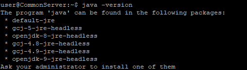
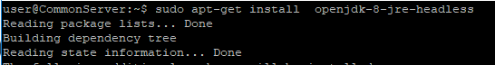
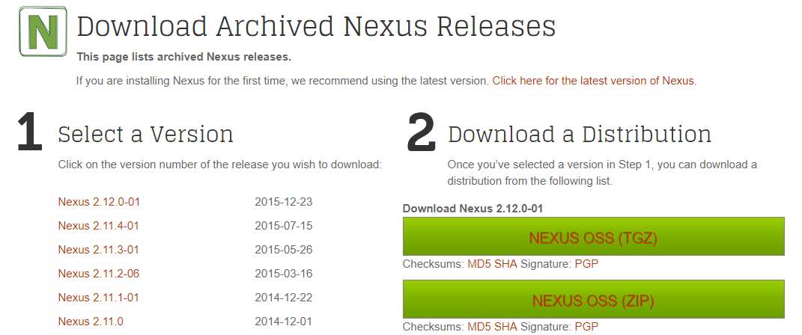
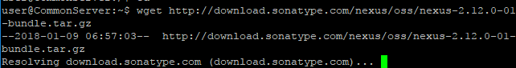
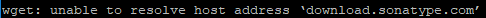
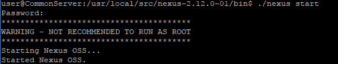
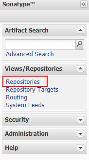
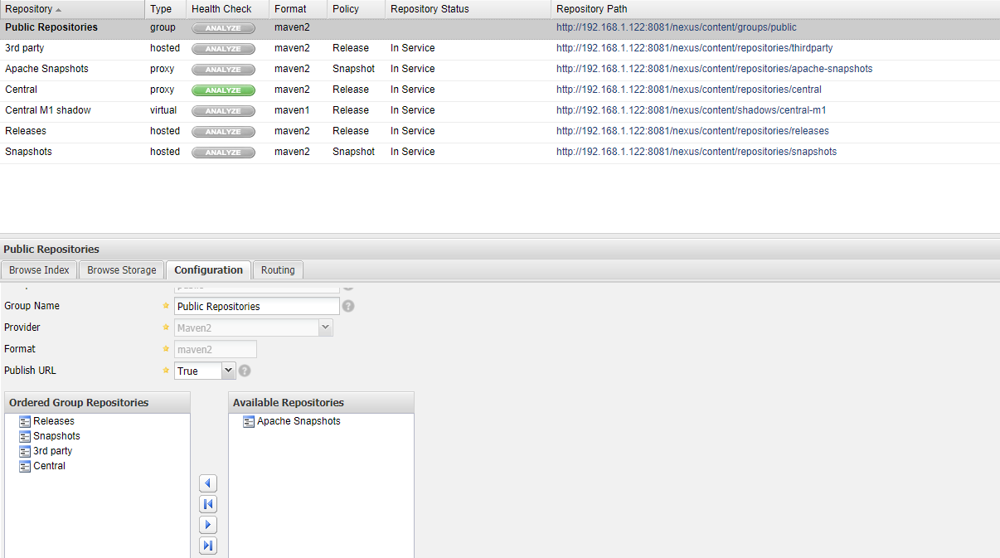
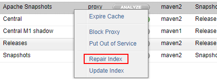
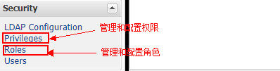

# nexus搭建maven仓库
@(maven)[nexus, maven]

---
[TOC]
## 安装jdk
使用`java -version`查看是否已安装`jdk`环境。如果提示如下，则需要安装`jdk`。

- 执行`sudo apt-get install xxx`，安装相应的`jdk`版本。如`sudo apt-get install openjdk-8-jre-headless`。

- 执行`java -version`会显示当前安装的`jdk`版本。
## 下载nexus
- 前往[nexus archived](http://www.sonatype.org/nexus/archived/)查看最新的nexus版本。
- 当前最新版本为`2.12.0-01`，右键**NEXUS OSS(TGZ)**复制链接地址。
- 执行`wget http://download.sonatype.com/nexus/oss/nexus-2.12.0-01-bundle.tar.gz`下载nexus。

- 
如果出现dns错误导致无法解析地址，执行`sudo vi /etc/resolv.conf`，将`nameserver 192.168.1.1`修改为**google的域名解析服务器**：
```
nameserver 8.8.8.8
nameserver 8.8.4.4
```
- 解压缩`nexus-2.12.0-01-bundle.tar.gz`到`/usr/local/src`
执行`sudo tar -zxvf nexus-2.12.0-01-bundle.tar.gz -C /user/local/src`

## 启动nexus
- `cd /usr/local/src/nexus-2.12.0-01/bin`
- `sudo vi nexus`。将`#RUN_AS_USER=`修改为`RUN_AS_USER=root`。以`root`用户启动`nexus`。如果以非root用户启动则要同时确保` sonatype-work` 和 `nexus`目录具有**读写**权限（ sonatype-work存储数据，nexus需要写入运行时日志）
- 启动nexus。`./nexus start`
- 配置环境变量
`export PATH=$PATH:/usr/local/src/nexus-2.12.0-01/bin`
- ip:port配置
`sudo vi nexus-2.12.0-01/conf/nexus.properties`

## 开机自启动nexus
- 建立软连接
`sudo ln -s /usr/local/src/nexus-2.12.0-01/bin/nexus /etc/init.d/nexus` 
- 修改nexus为可执行文件
`chmod 755 /etc/init.d/nexus`
- 将nexus设置为系统服务
`sudo update-rc.d nexus defaults`
## 配置nexus
访问地址：`http://ip:8081/nexus`。默认管理员账户/密码为`admin/admin123`。
登录之后点击左边菜单栏**Repositories**进入详细配置。

### 关于仓库类型介绍：
- `hosted`：内部项目的发布仓库
- `proxy`：远程中央仓库的代理仓库
- `virtual`：虚拟的模块的镜像仓库
- `group`：所有仓库的集合，方便开发人员设置需要的仓库
### nexus默认提供的仓库：
- `Public Repositories`：**group**类型，项目中配置此链接，自动从组内的各个仓库中查找对应的库
- `3rd party`：**hosted**类型，存放第三方模块的仓库
- `Apache Snapshots`：**proxy**类型，代理ApacheMaven仓库的SNAPSHOTS版本的仓库
- `Central`：**proxy**类型，代理maven中央仓库中发布版本模块的仓库
- `Central M1 shadow`：**virtual**类型，用于提供中央仓库中M1格式的发布版本的模块镜像仓库
- `Releases`：**hosted**类型，内部模块的release版本发布仓库
- `Snapshots`：**hosted**类型，内部模块的SNAPSHOT版本发布仓库
### 配置仓库
使用nexus自带的`Public Repositories`，需要将代理的库配置映射到public中，分别将`Apache Snapshots`、`Central`的`Configuration`下的**Download Remote Indexes**修改为**True**(默认是False)，保存。
将需要的**proxy**类型的仓库配置到`Public Repositories`：
- 选择`Public Repositories`
- 在**Configuration**将**Available Repositories**添加到**Ordered Group Repositories**，保存。
- 分别将`Apache Snapshots`、`Central`更新Index，在每一个库上面右键操作**Repair Index**
- 最后将`Public Repositories`操作**Repair Index**
- 完成，在项目中直接引用`Public Repositories`的maven仓库。
### 管理user
管理员用户登录后点击**Security**下的**Users**，可进行User管理。默认情况下nexus提供3个user：`admin`、`deployment`、`anonymous`。默认密码为`{userid}123`。
用户**Users**对应角色**Roles**，角色可配置拥有不同的权限**Prileges**。
- `admin`：管理员用户，角色：`Administrator`，拥有所有权限。
- `deployment`：部署构件用户，角色：`Deployment`，所有仓库的控制权限及基础的UI可视权限。
- `anonymous`：匿名用户，角色：`Annoymous`，所有仓库的读权限及基础UI。
可自定义用户，角色，权限组进行不同需求配置。